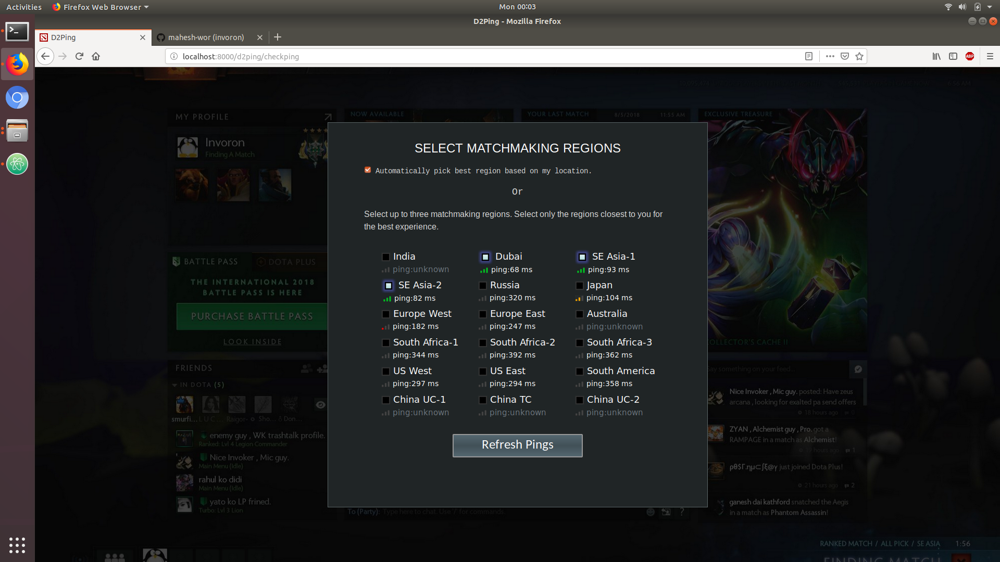

# d2ping-django
Django Implementaion of dota2pyping.

no need to open the game to just check your ping.
just goto http://invoron.pythonanywhere.com/


## Installation

Linux: (can be modified for windows & osx)

```sh
git clone https://github.com/mahesh-wor/d2ping-django/
cd d2ping-django
```
## Set Up virtualenv and install Django
```sh
python3 -m venv <your_env>
source yourenv/bin/activate
pip3 install -r requirements.txt  
```
## Usage example
```
visit localhost:8000 // or  http://invoron.pythonanywhere.com/
```
## Meta
Steam-ID – [@invoron](https://steamcommunity.com/id/dendironqwe) 

Mahesh-wor – [@mahesh-wor](https://twitter.com/mahesh-wor) – maheshwor89@gmail.com

Distributed under the GPL license. See ``LICENSE`` for more information.

[https://github.com/mahesh-wor/d2ping-django(https://github.com/dbader/)

## Contributing

1. Fork it (<https://github.com/mahesh-wor/d2ping-django/fork>)
2. Create your feature branch (`git checkout -b feature/fooBar`)
3. Commit your changes (`git commit -am 'Add some fooBar'`)
4. Push to the branch (`git push origin feature/fooBar`)
5. Create a new Pull Request

<!-- Markdown link & img dfn's -->
[npm-image]: https://img.shields.io/npm/v/datadog-metrics.svg?style=flat-square
[npm-url]: https://npmjs.org/package/datadog-metrics
[npm-downloads]: https://img.shields.io/npm/dm/datadog-metrics.svg?style=flat-square
[travis-image]: https://img.shields.io/travis/dbader/node-datadog-metrics/master.svg?style=flat-square
[travis-url]: https://travis-ci.org/dbader/node-datadog-metrics
[wiki]: https://github.com/mahesh-wor/dota2pyping/wiki
